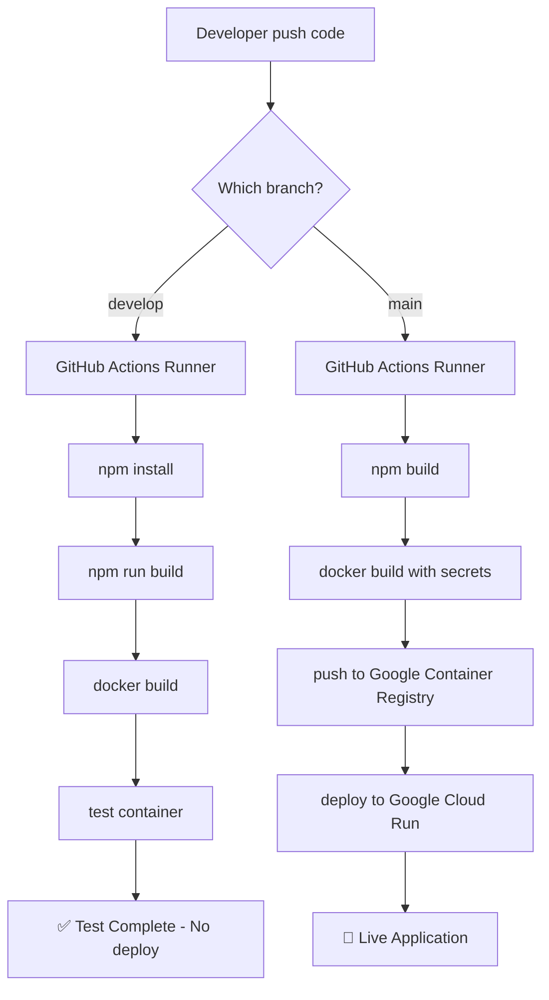

# Gdzie uruchamiają się GitHub Actions workflows - Knowlegather

## 🏃‍♂️ Lokalizacje wykonywania workflows

### Branch `develop` - Test Build
**Gdzie się uruchamia:** Na **GitHub Actions runners** (serwery GitHub)

**Co robi:**
- Instaluje npm packages
- Buduje aplikację (`npm run build`)
- Buduje Docker image 
- Testuje czy kontener odpowiada na port 8080
- **NIE deployuje nigdzie** - tylko testuje czy wszystko się kompiluje

**Trigger:** Push lub PR na branch `develop`

**Rezultat:** ✅ Potwierdzenie że kod się kompiluje i działa lub ❌ błędy do naprawienia

---

### Branch `main` - Deploy to Cloud Run  
**Gdzie się uruchamia:** Najpierw na **GitHub Actions**, potem deploy na **Google Cloud**

**Co robi:**
1. **Na GitHub Actions:** Buduje Docker image z production args
2. **Na GitHub Actions:** Pushuje image do Google Container Registry 
3. **Na Google Cloud:** Deployuje kontener na Cloud Run
4. **Na Google Cloud:** Testuje czy aplikacja odpowiada

**Trigger:** Push lub PR na branch `main`

**Rezultat:** 🚀 Aplikacja dostępna publicznie na Google Cloud Run URL

---

## 🎯 Workflow Strategy

```
develop push → GitHub Actions → TYLKO TEST (nie deploy)
main push    → GitHub Actions → BUILD → Google Cloud Run DEPLOY
```

### Schemat przepływu:



## 🌍 Aktualny status:

**Co się dzieje teraz:**
- Push na `develop` uruchamia się na **GitHub Actions runners**
- To tylko test - sprawdza czy kod się kompiluje i kontener działa
- Aplikacja **nie jest jeszcze** wdrożona na Google Cloud

**Żeby wdrożyć na Google Cloud:**
```bash
git checkout main
git merge develop
git push origin main
```
Wtedy automatycznie wdroży na produkcję na Google Cloud Run!

## 📍 URLs i lokalizacje:

- **GitHub Actions:** https://github.com/xrx415/knowlegather/actions
- **Google Cloud Console:** https://console.cloud.google.com/run?project=knowlegather
- **Supabase Dashboard:** https://supabase.com/dashboard/project/fyebojtynxasphohnrjh

## 🔧 Debugging:

**Jeśli test na develop fails:**
- Sprawdź logi w GitHub Actions tab
- Popraw błędy i push ponownie na develop

**Jeśli deploy na main fails:**
- Sprawdź GitHub Actions logs
- Sprawdź Google Cloud Run logs  
- Zweryfikuj secrets w GitHub repository settings
